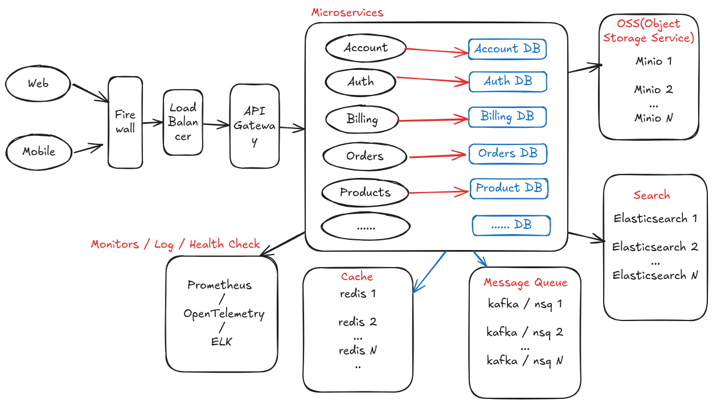

# Design & Architecture Questions

## 1. How would you manage high-concurrency in a Go microservice (thousands of requests per second)?

**Key Strategies:**

### Application Level

- **Connection Pooling**: Use `http.Transport` with appropriate `MaxIdleConns` and `MaxIdleConnsPerHost` settings to reuse connections efficiently
- **Worker Pool Pattern**: Implement bounded worker pools using channels to limit concurrent goroutines and prevent resource exhaustion
- **Resource Limiting**: Use `sync.Pool` for object reuse, set appropriate `GOMAXPROCS`, and implement circuit breakers
- **Async Processing**: Offload heavy operations to background goroutines using channels and queues

### Microservice Architecture Level

- **Service Decomposition**: Break monolithic services into smaller, focused microservices based on business domains
- **Horizontal Scaling**: Deploy multiple instances of each microservice behind load balancers
- **Database Sharding**: Partition data across multiple databases to distribute read/write load
- **Message Queues**: Use async messaging (Kafka, NSQ) for inter-service communication to decouple services
- **Circuit Breaker Pattern**: Implement circuit breakers to prevent cascade failures between services
- **API Gateway**: Use API gateways (Kong, Envoy) for request routing, rate limiting, and load balancing
- **Service Mesh**: Implement service mesh (Istio, Linkerd) for advanced traffic management and observability

### Infrastructure Level

- **Database Optimization**: Use connection pooling (`sql.DB` with `SetMaxOpenConns`, `SetMaxIdleConns`), prepared statements, and read replicas
- **Caching**: Implement multi-level caching (in-memory, Redis) with appropriate TTLs and cache invalidation strategies
- **Load Balancing**: Use reverse proxies (nginx, HAProxy) and implement health checks
- **Auto-scaling**: Configure Kubernetes HPA or cloud auto-scaling based on CPU/memory/custom metrics

## 2. Recommended project structure for large Go services?

**Structure**

link: https://excalidraw.com/#json=baHGuxkUseRZfF75AzW0o,tdFPHrvkpfyyg06CIvNA3w



**For Single Microservice:**

```
/product-service
├── cmd/
│   └── main.go          # HTTP server
├── internal/
│   ├── handler/          # HTTP handlers
│   ├── service/          # Business logic
│   ├── repository/       # Data access layer
│   ├── middleware/       # HTTP middleware
│   ├── config/           # Configuration
│   ├── client/           # External service clients
│   │   ├── user/         # User service client
│   │   └── payment/      # Payment service client
│   ├── event/            # Event handling
│   │   ├── publisher/
│   │   └── consumer/
│   └── metrics/          # Metrics collection
├── pkg/                  # Public library code
│   ├── models/           # Data models
│   ├── utils/            # Utilities
│   └── errors/           # Custom errors
├── {projectName}proto/
│   ├── openapi/             # OpenAPI specs
│   ├── {projectName}.proto  # gRPC protobuf definitions
├── migrations/              # Database migrations
├── deployments/             # Kubernetes manifests
│   ├── dev/
│   ├── staging/
│   └── prod/
├── scripts/              # Build and deployment scripts
├── Dockerfile
├── docs/
├── go.mod
├── go.sum
├── Makefile
└── README.md
```

**For Microservices Monorepo:**

```
/microservices-platform
├── services/
│   ├── product/
│   │   ├── cmd/
│   │   ├── internal/
│   │   ├── pkg/
│   │   ├── {projectName}proto/
│   │   └── Dockerfile
│   ├── user/
│   │   ├── cmd/
│   │   ├── internal/
│   │   ├── pkg/
│   │   ├── {projectName}proto/
│   │   └── Dockerfile
│   └── order/
│       ├── cmd/
│       ├── internal/
│       ├── pkg/
│       ├── {projectName}proto/
│       └── Dockerfile
├── shared/               # Shared libraries
│   ├── pkg/
│   │   ├── auth/         # Authentication utilities
│   │   ├── metrics/      # Metrics collection
│   │   ├── middleware/   # Common middleware
│   │   ├── database/     # Database utilities
│   │   └── messaging/    # Message queue utilities
│   └── proto/            # Shared protobuf definitions
├── infrastructure/       # Infrastructure as Code
│   ├── kubernetes/
│   ├── terraform/
│   └── helm/
├── deployments/          # Deployment configurations
│   ├── dev/
│   ├── staging/
│   └── prod/
├── scripts/              # Build and deployment scripts
├── docs/
├── go.work               # Go workspace file
├── docker-compose.yml
├── Makefile
├── go.mod
└── README.md
```

**Key Principles for Microservices:**

- **Service Independence**: Each service has its own codebase, database, and deployment pipeline
- **Domain Boundaries**: Services are organized around business capabilities, not technical layers
- **API-First Design**: Define service contracts (OpenAPI/gRPC) before implementation
- **Shared Libraries**: Common functionality in shared packages to avoid code duplication
- **Infrastructure as Code**: All deployment configs version-controlled
- **Observability**: Built-in logging, metrics, and tracing for each service
- **Configuration Management**: Environment-specific configs with secrets management
- **Event-Driven Architecture**: Services communicate via events when possible

**Microservice-Specific Considerations:**

- **Service Discovery**: Configuration for service registration and discovery
- **Circuit Breakers**: Resilience patterns for inter-service communication
- **Database per Service**: Each service manages its own data store
- **Event Sourcing**: Consider event sourcing for complex business logic
- **CQRS**: Separate read/write models for scalability

## 3. Approach to configuration management in production?

**Multi-layered Configuration Strategy:**

1. **Environment Variables**: Primary source for production configs. `.env` files for local development
2. **Configuration Files**: `.yaml` or `.toml` file for complex nested configurations
3. **Command Line Flags**: For runtime overrides
4. **Secret Management**: Use Vault, AWS Secrets Manager, or Kubernetes secrets, or ETCD

**Best Practices:**

- Use `viper` library for configs
- Validate configs
- Support hot-reloading for non-critical configs
- Use typed configs with struct tags
- Separate dev/staging/prod configs
- Never put secrets in version control

**Personal Opinion**

In production, my approach to configuration management follows three key principles: separation of config from code, centralization, and dynamic reload support.

- For basic configurations, I rely on environment variables, which work well in containerized environments and CI/CD pipelines.
- For complex or dynamic configurations, I use ETCD as a central configuration store. These provide distributed, consistent, and watchable key-value storage, allowing services to reload config without restarting.

In Go, I typically use libraries like `Viper` to load config from multiple sources (e.g., etcd, file, env). They support hot reload and structured binding into Go structs.

Secrets are managed separately using Vault or Kubernetes secrets, not embedded in config.

## 4. Observability strategy (logging, metrics, tracing)?

**Three Pillars Implementation:**

### Logging

- **Structured Logging**: Use `zap` or `logrus` with JSON format(I prefer `zap`)
- **Log Levels**: DEBUG, INFO, WARN, ERROR with appropriate filtering
- **Correlation IDs**: Track requests across services
- **Centralized Logging**: Use ELK / DataDog / Dynatrace stack or similar

**here is one of my zap logger wrap** : https://github.com/athxx/goutils/tree/main/utils/logx

### Metrics

- **Prometheus**: Use `prometheus/client_golang` for metrics collection
- **Key Metrics**: Request rate, error rate, response time, resource utilization
- **Custom Business Metrics**: Track domain-specific KPIs

### Tracing

- **OpenTelemetry**: Implement distributed tracing
- **Jaeger/Zipkin**: Use for trace visualization
- **Span Context**: Propagate trace context across service boundaries

## 5. Go API framework of choice (e.g., Gin, Chi) and why?

### **Why Not Choose Gin, Echo, Fiber, or Chi as Microservice Frameworks?**

While Gin, Echo, Fiber, and Chi are excellent web frameworks, they are **not ideal for building microservices** due to the following reasons:

- **Focused Solely on HTTP**: They are designed primarily for building web applications and APIs, not for building microservices that require service discovery, observability, configuration management, and RPC support.
- **Lack of Service Discovery**: These frameworks do not provide built-in service discovery mechanisms, which are crucial for microservices.
- **Limited Observability**: They lack built-in support for metrics, logging, and tracing, which are essential for monitoring and debugging microservices.
- **Configuration Management**: These frameworks do not offer flexible and centralized configuration handling, which is important for microservices.
- **RPC Support**: While they support HTTP, they do not optimize for gRPC communication between services, which is a common requirement for microservices.
- **Modular Design**: They do not encourage clean separation of concerns and domain-driven design, which are important principles for building maintainable microservices.

### Most Popular Go Microservice Frameworks

**Github Stars date : 2025-07-05**
| Framework | Highlights | Target Use Case | GitHub Stars | Learning Curve | Ecosystem/Community |
| ------------ | --------------------------------------------------------------------------- | ------------------------------------- | ------------ | -------------- | ------------------- |
| **Go-Kit** | Modular, enterprise-grade, focuses on clean architecture and design | Complex enterprise systems | ~27.1k | ⭐⭐⭐⭐ | ⭐⭐⭐⭐ |
| **Go-Micro** | Lightweight, plugin-based, built-in service discovery and RPC | Cloud-native microservices | ~22.4k | ⭐⭐⭐ | ⭐⭐⭐⭐ |
| **Go-Kratos** | gRPC-first, structured framework by Bilibili, supports observability | Scalable production applications | ~24.6k | ⭐⭐⭐ | ⭐⭐⭐⭐ |
| **Go-zero** | Code generation, opinionated, supports REST/gRPC, built-in tools | Rapid development with best practices | ~31.4k | ⭐⭐ | ⭐⭐⭐⭐ |
| **Kitex** | High-performance RPC, developed by ByteDance, supports Thrift/Protobuf | High-QPS backend services | ~7.5k | ⭐⭐⭐ | ⭐⭐⭐⭐ |
| **Goa** | DSL-based design-first approach, generates OpenAPI/gRPC specs automatically | API-first service development | ~5.9k | ⭐⭐⭐⭐ | ⭐⭐⭐ |

---

| Use Case                                   | Suggested Frameworks |
| ------------------------------------------ | -------------------- |
| Clean architecture and extensibility       | Go-Kit, Kratos       |
| Rapid API development with REST/gRPC       | Go-zero, Goa         |
| High-performance RPC                       | Kitex                |
| Plugin-based, cloud-native services        | Go-Micro             |
| Design-first API specification and codegen | Goa                  |

## Framework Details (skip Kitex, Goa)

### 1. **Go-Kit**

- **Architecture:** Emphasizes modularity and separation of concerns (transport, endpoint, service).
- **Strengths:** Clean code structure, integration with metrics/logging/tracing tools.
- **Weaknesses:** Verbose boilerplate, slow to iterate.

### 2. **Go-Micro**

- **Architecture:** Plugin-driven, supports service discovery, broker, config, RPC out of the box.
- **Strengths:** Simple to start, cloud-native friendly, extensible.
- **Weaknesses:** Has had leadership and maintenance issues in the past.

### 3. **Go-Kratos**

- **Architecture:** gRPC + Protobuf-based, opinionated layout, service governance built-in.
- **Strengths:** Supports observability, tracing, config, logging, circuit breaking.
- **Weaknesses:** Heavily gRPC-focused; REST support needs customization.

### 4. **Go-zero**

- **Architecture:** Emphasizes code generation, supports RESTful APIs and gRPC.
- **Strengths:** Rapid development with best practices, automatic documentation generation.
- **Weaknesses:** Less flexible due to opinionated structure.

---

## Recommendation : Go-Kratos

- **gRPC‑First & Full‑Stack Support**: Designed around Protobuf/gRPC, Kratos offers built‑in service discovery, load‑balancing, circuit-breaking, tracing, metrics (Prometheus), logging, recovery, and config management.
- **Opinionated, Modular Structure**: Comes with a consistent project layout and modular architecture—transport, middleware, registry, config—making it easy to maintain and standardize across teams.
- **Robust Tooling & Code Generation**: Includes CLI tools for generating service skeletons, cache layers, validation, Swagger/OpenAPI docs, error enums, and gRPC code—cutting setup time significantly.
- **Production-Proven at Scale**: Backed by Bilibili's usage in production, and enjoys strong community activity and adoption.
- **High Observability & Resilience by Default**: Integrates Prometheus and OpenTelemetry by default; resilience patterns (retry, circuit-breaker, panic recovery) are baked into the framework.
- **Well-Maintained & Actively Developed**: Actively updated with frequent commits and releases, ensuring long-term viability.
